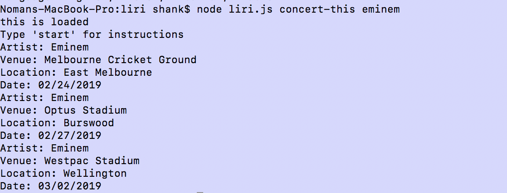

## Liri App

- LIRI stands for Language Interpretation Recognition Interface, with this app you will be able to find concert info on your favorite artists, movie info about your favorite movies as well as song info about your favorite songs.

## API'S

1. Spotify
   The Spotify API is used to pull info from your favorite song and push it into the node console. By searching any song you like, you can instantly receive information about that song using the LIRI App.
2. BandsInTown
   The BandsInTown API is used to find concert information in your favorite artist. By inputting the artist you would like results on, the API retreives and then displays concert information including the last tour dates and the next ones.
3. OMDB
   OMDB is a movie database API that allows a user to retreive information about a movie that they search. By inputting the movie into the console, the API will retreive the actos, plot, year released and more.

## Installs Required

Since the LIRI bot runs on nodeJS there are packages that need to be installed to the root folder in order for this application to work. To install these programs we use NPM. (npm i <"the program">).

- Node-Spotify API is installed by typing nmp i node-spotify-api in your root folder in the console

- AXIOS- Axios is used to grab both the BANDS IN TOWN api and the OMDB API. By running the get method in your code you can pull informtion from both of these APIS.

- MOMENT- you can install moment by typing in < npm i moment> This helps format the timing of the concerts in the Bands In Town Application

- DotEnv- DotEnv hides your API key and secret for spotify. This is installed in your console by typing < npm i dotenv>

### Running the Application

- Once all the required packages are installed into the root folder you are ready to run the LIRI bot.

- Start by typing in node liri.js to run your javascript this gives you an option to type in "start" to give you the Instructions for the LIRI Bot
  

- Then we type in <"node liri.js start> once this is done, you will receive a prompt of commands you can run for the bot.

- Once a command is picked the BOT will run.. to start we will do the spotify-this-song command
  

- We see now that when the song is input we receive back information from the API

- Another Command we can run is movie-this <"your movie>
  

- We see from the picture above that upon running this command info from the movie is displayed in the console.

Lastly, we can run the concert-this command. We run this by inputting the name of the band or artist we want a schedule for after the node liri concert-this.

- We See in the above screenshot that the API retreives information to show the next concert for the given artist which is in this case Eminem.
